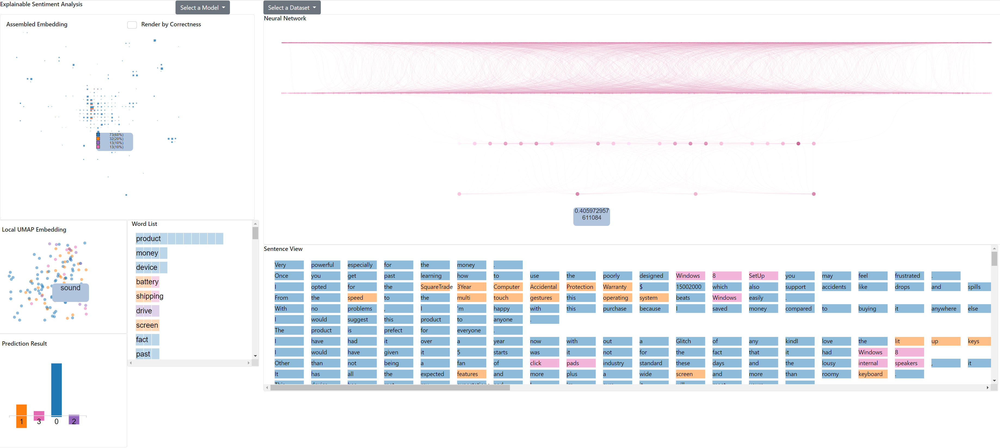

# CSE573-SP21-Project
A repo for our project in explainable sentimental analysis

## Datasets Processing
  1. For this project, we will use the most popular ABSA bechmark datasets, which are restaurant reviews from SemEval 2014(rest14), 2015(rest15), 2016(rest16). The laptop reviews, which are from SemEval 2014(laptop14), will also be used to help training the different models, all data files are in the `data` folder. For the ABSA label vocabulary categories, the possible values of the tag are B-{POS, NEG, NEU}, I-{POS, NEG, NEU}, E-{POS, NEG, NEU}, T-{POS, NEG, NEU}, S-{POS, NEG, NEU}, O-{POS, NEG, NEU}. The tagging schemes are BIEOS, IOB, OT, and inside-outside-beginning tagging. The file under`data` folder called `data preprocessing.ipynb` provides a reader machine which can split the sampeles and labels, furthermore, we assign the ABSA vocabulary categories new labels, 0 means no aspect, 1 means postive, 2 means neutral, 3 means negative.

## Training Script:
The training script has several parameters found at the top of the script. The first is "conditioning" which when set to true will normalize the data. "trainingSize" specifies how many samples from the training set you wish to use. For the laptop data set, it's best to use 2000 samples, whereas for the restaurant data set, use 1000.
The variable "testingSize" indicates how many of the test samples you would like to test on. The variable "bertFineTune" indicates to the script whether you would like to use fine tuning when producing word vectors, and the variable "train" indicates whether the user wants to retrain a new model, or load an existing one.

The variable trainAspects is used to decide whether training should only occur with samples labelled with either 1,2, or 3 (POS,NEU,NEG). This will be the case if true, and will cause the script to run longer to remove all non-aspect samples.

The variable "modelType", which can be either 'LIN', 'CNN', to 'MLP' corresponds to building a linear model, convolutional neural net, or multilayer perceptron, respectively.
Lastly, the variable "dataType" which can be either 'rest' or 'laptop' indicates the user wishes to train or test on the laptop dataset or the rest16 dataset, respectively.

The overall structure of the script is as follows: First the data is read into list structures, and then from these lists we form Bert embeddings that are placed into new structures. We then create several files to store this data, which will be used in our UI later. Next we define an evaluation function that takes a list of predictions and compares them against the training labels. From this it computes a series of metrics which are output to a file.
Next we train a model and evaluate it based on the user defined parameters.
Lastly we have a small section of code reserved for testing specific user-defined sentences with the chosen model.

NOTE: The folders labelled "Models" and Evaluations" contain preliminary models. All final results are in the folder labelled "FinalModelResults".

Please contact jwweber@asu.edu if there are any questions here.

# UI usage
## How to run the UI
  1. To view the UI, go to folder `frontend` and start a local server and render the file `explainableSentimentAnalysis.html`. You can use http.server of python to start your own local server (e.g. `python -m http.server 1008`).
  2. The final prediction and all the intermediate outputs of the neural networks on all the data points are pre-computed and stored locally as static files. Per different queries those files are retrived. Due to the size of the files we are not able to include them in this github repo, so you will need to download two files [preds_test_rest.zip](https://drive.google.com/file/d/1Y4yhjeHo3Hm_qmOMTLC6jUg3jTyl23hp/view?usp=sharing) from google drive (files are only accessible for asu account) and unzip them and place them under directory `frontend` so they can be read properly.
  3. Upon initializing the page you'll see an empty interface like this:
  

  Don't freak out, you're at the right place just that you need to select the dataset and model to see some interesting visualizations. So hit the buttons on top to select dataset and model. After that you'll be ready to start your journey. Check out the loaded interface!
  
  
## The user interface
The design philosophy: Neural networks are trained on dataset. Hence, a well-rounded explanation of a neural network needs to includes explanation of the dataset. A peculiar behavior of an NN is usually due to a peculiar subset of the dataset or a peculiar distribution of data points. In this work We pay a lion share of attention to augment users' ability to relate NN behaviors with dataset to attain a holistic, contextualized explanation.

### 1. Assembled Embedding (AE) view
Two-dimensional representations of 768-dimensional BERT-generated vectors. The 2-d dots are then aggregated locally into multiple cells to reduce visual clutter and provide overview. The AE view also gives us a general picture of the data distribution without demanding much cognition.
#### 1.1 Cell Design
The size of each cell in AE view is proportional to the number of dots within the cell. The color of the cell reflects the distribution of different categories in the cell. (e.g. A cell of pure color means all the dots in the locality the cell represents are of the same class)
#### 1.2 Click a cell to see local detail
To reveal points in a locality, the user clicks the corresponding cell of that locality. Multiple views that present different insights of the selected locality are updated meanwhile.
#### 1.3 Hover to show data distribution
The user can hover on a cell to see the distribution of different classes in the cell
#### 1.4 Zoom and Pan
Scrolling the mouse on the AE view to zoom in and out. Drag on the view for panning.
### 2. Local UMAP Embedding View
A scatter plot displaying dots in the selected locality is updated when the user selects a cell in AE view. Dots representing words are colored by their labels. The UMAP technique encodes high-dimensional data in a way that keeps proximity, meaning dots near to each other in the high-dimensional space are kept near to each other in the UMAP embedding.
#### 2.1 Hover to see the word
Hover on a datapoint and the word the datapoint represents will pop up in a tooltip.
#### 2.2 Click to see how the datapoint flows through the neural network
Click a datapoint and the neural network view will be updated. Highly activated neurons are marked by dark color whereas mildly activated neurons are marked by light color. The color of the neurons relates the color of the data point so as to keep visual consistency.
### 3. Local Word List
To support users inspecting data points at localities from multiple perspective, we also display the distribution of words of the locality of interest in a customized scrollable vertical barchart. Words appearing in the locality are grouped up in different rows, each occurrence of a word has a corresponding rectangle laid in its row. Rectangles are colored identically the way the dots are colored.
### 4. Local Diverging Barchart
We use a diverging barchart to showcase the performance of the selected neural architecture on the selected locality. Each class has a bar correspondent, the portion of correctly classified samples in a class is represented by the above-x-axis part of a bar. The misclassified portion is represented by the below-x-axis part of a bar.
### 5. Context view
The sentence view shows the sentence (context) where the words of interest come from
### 6. The Neural Architecture (Network) View 
#### 6.1 NN view for Linear Model and MLP
For Linear NN and MLP we use node-link diagram to visualize their architecture. Weak Links with low weights are abandoned to keep users' attention on strong links which contributes to the NN's decision making process. The darker the nodes (links) the greater the values.

#### 6.2 NN view for CNN
For CNN we used Grad-Cam technique to visualize the attention each layers has on the input. The attention maps tell us where the layer is looking at on the input image, which is a word embedding reshaped to 2d.

#### 6.3 Hover on nodes to see actual activation values underneath

